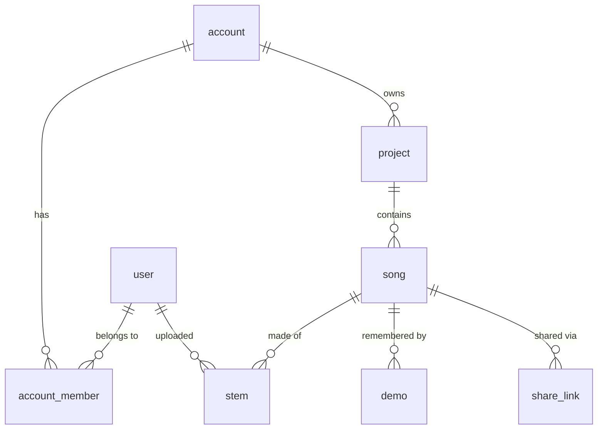

# Data model plan: accounts, users, projects, songs

Status: **implemented** (migration `drizzle/0000_*.sql`). This document is
the rationale; the schema files under `src/lib/server/db/schema/` are the
source of truth. Differences from the original proposal: `stem.sample_rate`
was dropped (the browser only sees the resampled rate), `stem.url` is `""`
while an upload is in flight because the Blob URL is unknown until the file
exists, and all `relations()` live in `schema/relations.ts` so table files
form a DAG instead of importing each other.

## Shape

- **user** — a person who signs in. Columns follow Better Auth's core `user`
  shape so adding Better Auth later (as replicator did) needs no migration of
  this table. Better Auth's own tables (`session`, `verification`, and its
  provider-credential table) are added with it, not now.
- **account** — the tenant: a studio, band, or client workspace. Everything
  else hangs off an account, and every query is scoped by it.
- **account_member** — which users are in which account, with a role.
- **project** — a grouping of songs inside an account: an album, a session, a
  client job. Slug unique within the account.
- **song** — one piece of music with N stems. Carries the musical metadata
  (bpm, key) and the denormalized `account_id` so tenant scoping never needs a
  join through `project`.
- **song.sections** — the song's structure as JSON, `[{ name, start }]`
  with `start` in seconds, kept sorted; empty means no timeline. Marks are
  song-level, so replacing a stem never moves them.
- **song.changes** — tempo, key and time signature as timed changes,
  `[{ kind, start, value }]` with `kind` tempo | key | meter, `start` in
  seconds and `value` as text ("120", "F#m", "6/8"), sorted. The old
  single-value `bpm` / `musical_key` columns are gone (migration 0016).
- **stem.midi_url / midi_pathname / midi_filename / midi_size_bytes** — the
  stem's optional MIDI file in Blob (migration 0020); null when none.
- **song.version** — the song's own semantic version ("0.0.1" by default),
  managed by the user: nothing bumps it automatically, but after a stem is
  added, replaced or removed the song page offers a patch, minor or major
  bump. **song.stems_updated_at** is stamped by the server on those same
  three events (backfilled from the newest ready stem in migration 0019).
- **song.frame_rate** — 23.976 | 24 | 25 | 29.97 | 30, for timecode display
  and entry (25 by default, as in Logic).
- **song.start_at / end_at** — seconds where bar 1 begins and where the song
  ends (null = 0 / the last stem), for the bars readout and the timeline.
- **comment** — a member's comment on a song: title, plain text, an
  optional position (`at`, seconds) that puts it on the comment timeline
  under the stems, and `edited_at` once changed. Anyone in the account may
  post; the author edits and deletes their own, owners and admins delete any.
- **user_doc** / **user_doc_version** — the public documentation at
  `/docs/<slug>`: title, slug, sort order, markdown with the same hash-gated
  versioning as song documents (ten revisions kept). Written by system
  admins with the shared `MarkdownDocEditor`.
- Projects and songs carry `no_ai`; songs also hold the transcribed notes
  (`notes_json`, `notes_key`, `notes_done_seconds`, `notes_started_at`).
- **share_link** — a viewing code for one private song or one project
  (exactly one of `song_id` / `project_id`): note, creator, optional
  `expires_at` and `max_uses`, `uses`, `revoked_at`. Projects and songs carry
  `is_private`.
- **audit_log** — a super admin's request inside an account they do not
  belong to: user, account, `METHOD path`. Users carry `is_super_admin`.
- **ai_request** — one call to a model through the AI Gateway: kind, model,
  user, song, the text sent (no audio), the raw reply, the parsed answer or
  the error, duration and tokens. Reviewed on `/admin`.
- **bug_report** — a signed-in user's bug report (the footer) or feature
  request (`kind`; the Feature Requests page): title, body, the page they
  were on and their browser (captured by the form), `contact_email` when
  they offered one for follow-up, `status` open/complete/closed and
  `closed_at`, the admin's `priority`, `response` and `responded_at`.
  Managed on `/admin`.
- **invite_code** — a reusable sign-up code: `account_id` (null for a
  system admin's new-account code, which joins nothing), role, note,
  `max_uses` (null = unlimited), `uses`, optional `expires_at`, `revoked_at`.
- **invitation** — an invitation into an account: email, role, one-time
  token, who sent it, expiry, and when it was accepted or revoked.
- **demo** — a demo recording of the song idea (a phone memo, a rough take):
  one audio file in Blob at `accounts/<id>/songs/<id>/demos/<demoId>.<ext>`,
  with the same reserve → upload → ready lifecycle as a stem but no
  decoding, peaks or renditions. Played and downloaded as uploaded; up to
  `MAX_DEMOS_PER_SONG` per song. The song also carries `songwriter` (free
  text) and `written_on` (ISO date), edited from song settings.
- **idea** — an idea from the Idea Recorder (docs/demo-recording.md): a
  title, a markdown note board and who made it. Ideas are the user's own
  within the account (other members do not see them until a take is added
  to a song).
- **recording** — one take of an idea: an audio file at
  `accounts/<id>/recordings/<recordingId>.<ext>` (the private store when
  configured), numbered within the idea (`take_number`), with an optional
  name (`title`), the timed duration, the codec the browser reported at
  reservation (`codec`: alac, pcm, flac, opus or aac, migration 0042; the
  player asks `canPlayType` about the original before falling back to the
  MP3) and the same MP3 rendition columns as a demo. Adding a take to a song copies the file into a `demo` row of that
  song. (`notes` on this table is empty since migration 0041 moved notes
  to the idea; a later release drops it.)
- **stem** — one audio file in Vercel Blob, plus what the engine learns when it
  decodes it (duration, channels, sample rate, 1024 peaks). This is where plan
  step 2 ("persist peaks") lands.
- **share_link** — plan step 5. A revocable token that grants read access to
  one song without an account. Cheap to add now, so it is in the first
  migration.

- **song_doc_version** — history of the song's two markdown documents, the
  chart (chords, arrangement) and the lyrics, told apart by `kind`. The
  current text lives on `song.chart_markdown` / `song.lyrics_markdown`; a
  save writes a version row only when the SHA-256 changes, and the newest ten
  per document are kept. Text is stored in the row, not Blob: a few KB.

Not in the first cut, easy to add later: `mix` (saved fader/mute/solo state
per song), stem versions (replicator's `audio_version` pattern), comments.

## Conventions (matching replicator)

- Text primary keys, app-generated with `nanoid` (21 chars). No autoincrement.
- `snake_case` column names, `camelCase` in TypeScript.
- `created_at` / `updated_at` as `integer` with `mode: "timestamp_ms"`,
  defaulting to `unixepoch('subsecond') * 1000`, `updated_at` with
  `$onUpdate`. Shared via a `columns.ts` helper so every table is identical.
- One file per table under `src/lib/server/db/schema/`, barrel in `index.ts`,
  `relations()` declared next to each table.
- An index on every foreign key; composite unique constraints for slugs.
- Picklist columns are `text` with a `$type<...>()` union, values defined in
  one place (`src/lib/val/`), never a SQLite `CHECK`.
- `onDelete: "cascade"` down the ownership chain (account → project → song →
  stem); `"set null"` for "who did this" references to `user`.

## Tables

### user

| column         | type                    | notes                              |
| -------------- | ----------------------- | ---------------------------------- |
| id             | text PK                 | nanoid                             |
| name           | text not null           |                                    |
| email          | text not null unique    |                                    |
| email_verified | integer bool, default 0 | Better Auth column                 |
| image          | text null               | Better Auth column (avatar URL)    |
| is_active      | integer bool, default 1 | soft-disable without deleting rows |
| created_at     | timestamp_ms            |                                    |
| updated_at     | timestamp_ms            |                                    |

### account

| column              | type                 | notes                                                                              |
| ------------------- | -------------------- | ---------------------------------------------------------------------------------- |
| id                  | text PK              | nanoid; also the top-level Blob folder (see below)                                 |
| name                | text not null        |                                                                                    |
| slug                | text not null unique | URL-safe, for `/a/<slug>/…` routes                                                 |
| status              | text, default active | `active` \| `suspended`                                                            |
| storage_limit_bytes | integer null         | null = unlimited; enforced at token issue time                                     |
| plan                | text, default free   | subscription tier; only `free` today (docs/billing.md)                             |
| lifetime_free       | integer bool, def. 1 | never a base subscription cost                                                     |
| is_founder          | integer bool, def. 0 | never charged, unlimited data, every feature; first 20 accounts, then super admins |
| created_at          | timestamp_ms         |                                                                                    |
| updated_at          | timestamp_ms         |                                                                                    |

### account_member

| column     | type                        | notes                                      |
| ---------- | --------------------------- | ------------------------------------------ |
| id         | text PK                     |                                            |
| account_id | text FK → account (cascade) |                                            |
| user_id    | text FK → user (cascade)    |                                            |
| role       | text, default member        | `owner` \| `admin` \| `member` \| `viewer` |
| created_at | timestamp_ms                |                                            |
| updated_at | timestamp_ms                |                                            |

Indexes: `(user_id)`, `(account_id)`, unique `(user_id, account_id)`.

### project

| column      | type                        | notes                              |
| ----------- | --------------------------- | ---------------------------------- |
| id          | text PK                     |                                    |
| account_id  | text FK → account (cascade) |                                    |
| name        | text not null               |                                    |
| slug        | text not null               | unique with `account_id`           |
| description | text, default ""            |                                    |
| status      | text, default active        | `active` \| `archived`             |
| archived_at | timestamp_ms null           |                                    |
| sort_order  | integer, default 0          | manual ordering inside the account |
| created_by  | text FK → user (set null)   |                                    |
| created_at  | timestamp_ms                |                                    |
| updated_at  | timestamp_ms                |                                    |

Indexes: `(account_id)`, unique `(account_id, slug)`.

### song

| column           | type                        | notes                                             |
| ---------------- | --------------------------- | ------------------------------------------------- |
| id               | text PK                     |                                                   |
| account_id       | text FK → account (cascade) | denormalized from project for scoping             |
| project_id       | text FK → project (cascade) |                                                   |
| title            | text not null               | what the user typed; today we derive it from slug |
| slug             | text not null               | unique with `project_id`                          |
| bpm              | real null                   |                                                   |
| musical_key      | text null                   | "D", "F#m"; free text for now                     |
| duration_seconds | real null                   | longest stem; updated when stems change           |
| description      | text, default ""            | optional free text shown under the title          |
| chart_markdown   | text, default ""            | current chart; history in song_doc_version        |
| chart_hash       | text null                   | SHA-256 of chart_markdown                         |
| chart_version    | integer, default 0          | number of the current version; 0 = never saved    |
| lyrics_markdown  | text, default ""            | lyrics document; history in song_doc_version      |
| lyrics_hash      | text null                   |                                                   |
| lyrics_version   | integer, default 0          |                                                   |
| status           | text, default active        | `active` \| `archived`                            |
| is_finished      | integer bool, default 0     | done: filed under "Finished Songs" (any member)   |
| sort_order       | integer, default 0          | inside the project                                |
| created_by       | text FK → user (set null)   |                                                   |
| created_at       | timestamp_ms                |                                                   |
| updated_at       | timestamp_ms                |                                                   |

Indexes: `(account_id)`, `(project_id)`, unique `(project_id, slug)`.

### stem

| column           | type                        | notes                                                        |
| ---------------- | --------------------------- | ------------------------------------------------------------ |
| id               | text PK                     | used in the Blob pathname, so renames never move files       |
| account_id       | text FK → account (cascade) |                                                              |
| song_id          | text FK → song (cascade)    |                                                              |
| label            | text not null               | "Bass DI"; defaults to the filename minus extension          |
| sort_order       | integer, default 0          | row order in the player                                      |
| gain             | real, default 1             | the default mix: this stem's fader, 0..1.25; members save it |
| status           | text, default uploading     | `uploading` \| `ready` \| `failed` (see upload flow)         |
| url              | text not null               | Blob URL                                                     |
| pathname         | text not null unique        | Blob pathname                                                |
| filename         | text not null               | original name from the browser                               |
| content_type     | text not null               |                                                              |
| size_bytes       | integer not null            |                                                              |
| duration_seconds | real null                   | filled after the browser decodes it                          |
| channels         | integer null                | 1 mono, 2 stereo                                             |
| sample_rate      | integer null                | of the file, not the 32 kHz context                          |
| peaks            | text json null              | `number[]` of 1024 values 0..1, from `peaks.ts` (~8 KB/row)  |
| uploaded_by      | text FK → user (set null)   |                                                              |
| created_at       | timestamp_ms                |                                                              |
| updated_at       | timestamp_ms                |                                                              |

Indexes: `(song_id, sort_order)`, `(account_id)`.

### song_doc_version

| column         | type                      | notes                      |
| -------------- | ------------------------- | -------------------------- |
| id             | text PK                   |                            |
| song_id        | text FK → song (cascade)  |                            |
| kind           | text not null             | `chart` \| `lyrics`        |
| version_number | integer not null          | 1, 2, 3… per song and kind |
| markdown       | text not null             | full text of that revision |
| content_hash   | text not null             |                            |
| created_by     | text FK → user (set null) |                            |
| created_at     | timestamp_ms              |                            |
| updated_at     | timestamp_ms              |                            |

Index: `(song_id, kind, version_number)`.

### share_link

| column     | type                      | notes                               |
| ---------- | ------------------------- | ----------------------------------- |
| id         | text PK                   |                                     |
| song_id    | text FK → song (cascade)  |                                     |
| token      | text not null unique      | nanoid(32); the URL is `/s/<token>` |
| expires_at | timestamp_ms null         | null = never                        |
| revoked_at | timestamp_ms null         |                                     |
| created_by | text FK → user (set null) |                                     |
| created_at | timestamp_ms              |                                     |

## How the existing Blob code changes

**Pathnames become ID-based.** Today: `stems/<song-slug>/<filename>`. With
the database: `accounts/<accountId>/songs/<songId>/<stemId>.<ext>`. Slugs and
labels can then change freely, and `list()` is only needed for
reconciliation, never to render a page. The four test stems in the store now
are throwaways; delete them rather than migrating.

**Upload flow with rows:**

1. Client creates the song (`POST /songs/new` form action) → `song` row.
2. For each file the client calls `upload()` with `clientPayload =
{ songId, filename, label }`. In `onBeforeGenerateToken` the server checks
   membership, inserts a `stem` row with `status: "uploading"`, and returns
   the pathname built from the new stem id (`tokenPayload = { stemId }`).
3. When `upload()` resolves, the client decodes the file (the engine already
   does this) and `POST`s duration, channels, sample rate and peaks to
   `/api/stems/[id]/ready`, which sets `status: "ready"` and refreshes
   `song.duration_seconds`.
4. `onUploadCompleted` (production only; Blob cannot reach localhost) is a
   backstop: it marks the stem `ready` if step 3 never arrived, and it is
   where an orphan sweep can reconcile `list()` against `stem.pathname`.

**Pages read from Turso.** `/songs/[slug]` becomes
`/a/[account]/[project]/[song]` and its `load` selects the song and its ready
stems ordered by `sort_order`; `peaks` from the row lets the waveform draw
before the audio finishes decoding.

**Until there is auth.** Seed one `account` ("Lightning Jar"), one `user`
(Kevin) and an `owner` membership. `hooks.server.ts` puts the user and their
memberships on `event.locals`; the URL's `[account]` segment picks the
account. Viewing is public by URL; editing requires membership, checked per
mutation against the entity's own account, so the switch to Better Auth is a
change to the hook, not to the queries.

## Wiring

- `bun add drizzle-orm @libsql/client nanoid`, `bun add -d drizzle-kit`.
- `.env.schema` gains `TURSO_DATABASE_URL` (`@type=url`) and
  `TURSO_AUTH_TOKEN` (sensitive); both come from 1Password like the Blob vars.
- `drizzle.config.ts` as in replicator (`dialect: "turso"`, schema barrel).
  drizzle-kit runs outside Vite, so it is invoked through `varlock run`:
  `"db:generate": "varlock run -- drizzle-kit generate"`,
  `"db:migrate": "varlock run -- drizzle-kit migrate"`,
  `"db:studio": "varlock run -- drizzle-kit studio"`.
- Migrations are generated files committed under `drizzle/`; they run from a
  developer machine, not during the Vercel build.
- `src/lib/server/db/index.ts` creates the client from `ENV` (as replicator).

## Decisions to confirm

1. **`account` vs `org`.** Replicator calls the tenant `org`. Using `account`
   here matches how you described it, but Better Auth's default table for
   provider credentials is also named `account`; when Better Auth is added,
   set `account: { modelName: "auth_account" }` in its config. Recommendation:
   keep `account` and rename Better Auth's table.
2. **Peaks in the row.** ~8 KB JSON per stem, read on every song page. Fine
   for tens of stems per song. If songs grow to hundreds of stems, move peaks
   to a sidecar blob (`…/<stemId>.peaks.json`) and store only its URL.
3. **No stem versioning yet.** Replicator keeps an `audio_version` table.
   Re-uploading a stem here overwrites it. Adding versions later is a new
   table plus a `current_version_id` on `stem`, no migration of existing rows.
